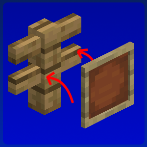

# SnappierFrames

A lightweight Fabric mod that makes item frames actually sit against the block they are mounted on.

[](https://modrinth.com/project/snappierframes)


## The problem

Vanilla item frames are always drawn exactly 15/32 blocks away from the center of their supporting block. That is correct for blocks that are 1x1 cubes, but wrong for everything else.

Fences, walls, glass panes, chests, iron bars, trapdoors, and more cause item frames to "float" a certain distance away from where you would expect them to be.

## What it does

SnappierFrames calculates the gap between the support block's model and where the item frame spawns by default, then adjusts where it appears so that it touches the block model. Both the item frame's model **and** the hitbox move, so a frame is always clickable exactly where you see it.

| Support block | Frame pulled back by |
| --- |----------------------|
| Chest (side) | 1/16 aka 2/32        |
| Chest (top) | 2/16 aka 4/32        |
| Wall post | 4/16 aka 8/32        |
| Fence post | 6/16 aka 12/32       |
| Glass pane, iron bars | 7/16 aka 14/32       |
| Chain | 6.5/16 aka 13/32     |
| Slab, frame on top | 8/16 aka 16/32       |
| Daylight detector, frame on top | 10/16 aka 20/32      |
| Closed trapdoor, frame on top | 13/16 aka 26/32      |

Nothing is hardcoded, the bounds of the block's model is determined at runtime, so modded blocks are handled automatically without SnappierFrames knowing they exist.

Glowing item frames and framed maps work exactly the same way.

### What it will not do

The measurement uses the block's overall shape, so a fence that has arms reaching toward the frame reports a full-width block and the frame stays where vanilla put it. It never guesses: when the shape is ambiguous the frame falls back to vanilla placement, so a frame is never pushed *into* a block it should be resting on.

## Installation

Requires [Fabric Loader](https://fabricmc.net/use/) 0.19.3 or newer and Minecraft 26.2. **Fabric API is not required.**

Drop the jar into your `mods` folder. Install it on the client for singleplayer.

For multiplayer, install it on **both** the client and the server. Client-only works but the server keeps vanilla hitboxes (will be slightly offset from what you see). Server-only is not useful on its own as vanilla clients would still draw frames in the old position while their hitboxes had moved, leaving you aiming at empty air.

## Building

```sh
./gradlew build
```

The jar lands in `build/libs/`. Java 25 is required, matching Minecraft 26.2.

## Bug reports

Please open an [issue](https://github.com/maneddante/SnappierFrames/issues) with your Minecraft version, Fabric Loader version, and the block the frame was mounted on. A screenshot helps.

## License

Copyright (c) 2026 ManedDante. All rights reserved.

The source is published so the mod can be inspected and issues reported against it. No permission to redistribute the mod or to create derivative works is granted - please get in touch on [Discord](https://discord.com/users/1077375956165075025) if you need something beyond that.
